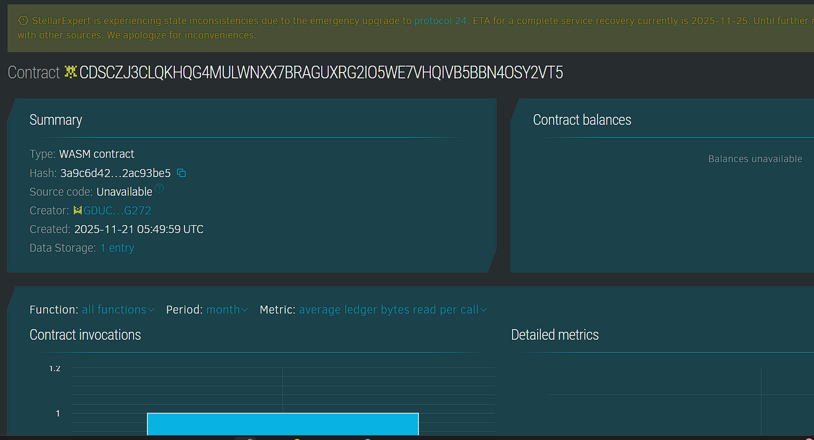

## Project Title
RustyWallet Tracker

## Project Description
RustyWallet Tracker is a personal finance command line tool that records expenses and generates daily and weekly summaries. Data is stored as JSON in a folder under the user home directory so it stays local and easy to back up or sync.

## Project Vision
The vision is to give individuals a simple focused tracker that makes it easy to understand spending patterns without depending on any external service or complex interface.

## Key Features
Record expenses with amount category and note for the current date. List all recorded expenses. Show total spending for the current day. Show total spending for the current calendar week based on ISO week numbers. Store data as JSON files in a hidden folder.

## Future Scope
Add category wise summaries and monthly reports. Add support for multiple wallets and currencies. Integrate with graphical frontends and export data to spreadsheets or other finance tools.

## Contract Details
Contract ID: CDSCZJ3CLQKHQG4MULWNXX7BRAGUXRG2IO5WE7VHQIVB5BBN4OSY2VT5
